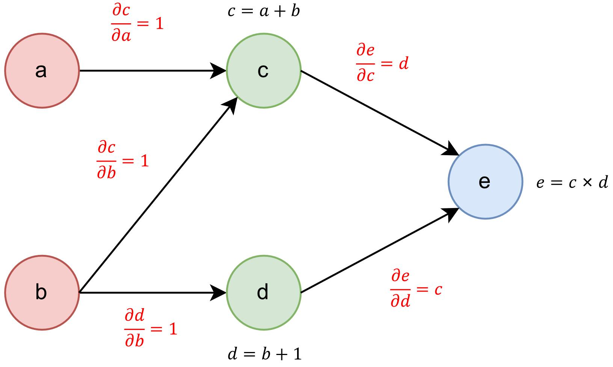

# toy_computational_graph

A minimal prototype of dynamic computational graph in ~200 lines. Only implement scalar types.

## How to run

Check the `example.py` for details.

```python
python example.py
```

Here is a quick example:
```python
from value import Scalar

x = Scalar(8)
y = Scalar(3)
r = (x * x + 1) / (y * y - 1)
r.backward()
print(f"x={x}, y={y}, r=(x*x+1)/(y*y-1)={r}")
print(f"=> x.grad={x.grad}, y.grad={y.grad}")
```

And the result is:
```
x=8.0, y=3.0, r=(x*x+1)/(y*y-1)=8.125
=> x.grad=2.0, y.grad=-6.09375
```

## How it works



Take this graph as example:
```
c=a+b
d=b+1
e=c*d
```

Nodes of the graph means a variable, and the edges represents the flow of the calculation. We define the value of each edge as the partial derivative.

To calculate the gradient of `e` with respect to `b`:
1. Find out all non repetitive paths from `b` to `e`. In this graph, there's only 2 path, i.e. `(b,c,e)` and `(b,d,e)`.
2. Calculate the cumulative product of the value of edges in each path. So `CUM_PRODUCT(b,c,e)=1*d=d` and `CUM_PRODUCT(b,d,e)=1*c=c`.
3. Sum up the cumulative products and get the gradient, that is, `d+c`.

In the implementation of the program, this process is done by iterations, and all the nodes is traversed in a `dfs` manner. However, in the implementation of PyTorch and other mature framework, this process is done in parallel.

## Notes

Each call to `backward()` on variable will add the gradient to the `.grad` property **without setting it to zero before**. So if you want to make multiple calls to `backward()` on the same variable, make sure to call the `zero_grad()` funcion at the beginning.

Actually, this behaviour is much like the PyTorch implementations, since the gradient has to be added in a parallel way to boost the performance.
